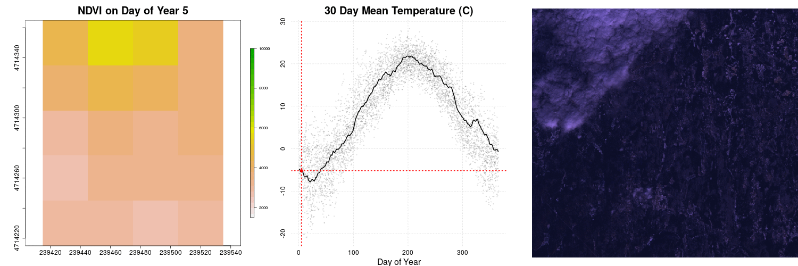

# Group 5 - Visualization: Making Pretty Maps and Plots

**Notes** in Google Docs: [Module Five - Making Pretty Maps & Plots - Google Docs](https://docs.google.com/document/d/1g6E8bxHtT-GZFh3T99l4laZra7jHwM0y8h-3Slr-MAE/edit#)

**HTML** rendered of this Rmd: [bbest.github.io/NEON-DC-DataLesson-Hackathon/code/group05_visualization.html](http://bbest.github.io/NEON-DC-DataLesson-Hackathon/code/group05_visualization.html).


## Learning Objectives

After completing this activity, you will know:

- Visual Outputs, generic to time series or maps
    - Outputting to different formats: pdf, png w/ resolution. html/pdf.
    - post-process in Adobe Illustrator or Inkscape
    - Titles, axes labels. margins.
    - Legends
    - Tiling / Faceting.
    - Color ramps. Choosing color ramps for types of data: categorical, continuous. - divergent. colorblind. Best practice for this data. Link out to more.
- Production Quality Maps, ie Cartography
    - Scalebar, projection, N arrow. map-specific
    - Symbology. pts, lines.
- Interactive
    - web-based interactive plot using Javascript libraries
    - specifics for R today, htmlwidgets R packages: leaflet, dygraphs
- Animation
    - existing raster time series animation of chm tower air shed
    - add time series next to it. point / pixel of individual stations + average. min/max/avg:

How to import rasters into `R` using the raster library.
How to perform raster calculations in `R`.

# Setup

```{r setup}
suppressPackageStartupMessages({
  library(raster)       # work with rasters
  library(dplyr)        # work with data frames
  library(rgdal)        # read/write spatial files, gdal = geospatial data abstraction library
  library(zoo)          # timeseries core package
  library(xts)          # extended time series
  library(ggplot2)      # plotting
  library(readr)        # readr::read_csv() preferable to read.csv()
  library(knitr)        # knitting Rmarkdown to html
  library(animation)    # create animation ot the NDVI outputs
  library(scales)       # breaks and formatting for ggplot2
  library(lubridate)    # work with time
  library(leaflet)      # interactive maps htmlwidget
  library(RColorBrewer) # color ramps
  library(dygraphs)     # interactive time-series htmlwidget
  library(stringr)      # handle strings
  library(animation)    # for making .gif animation
})

# set the working directory
wd = '~/github/NEON-DC-DataLesson-Hackathon/code/1_WorkshopData'
setwd(wd)
opts_knit$set(root.dir=wd)
```

```{r tmp_jday, eval=FALSE, echo=FALSE}
dir = '~/github/NEON-DC-DataLesson-Hackathon/code/1_WorkshopData/Landsat_NDVI/HARV/2011/ndvi'

d = data_frame(
  fname = list.files(wd)) %>%
  mutate(
    sfx = str_replace(fname, '([0-9]+)_(.*)', '\\2'),
    jday = as.integer(str_extract(fname, '[0-9]+')))

sprintf('%03d_%s\n', d$jday, d$sfx)

# http://www.regexr.com/
```

## Quick Plot: Raster

```{r quick_raster}
# read raster
chm <- raster("NEON_RemoteSensing/HARV/CHM/HARV_chmCrop.tif")

# see metadata
chm

# quick plot
plot(chm, main="NEON Canopy Height Model (Tree Height)\nHarvard Forest")
```

## Sequencing through Cartographic Elements

### Locator Map

- add polygon from package(map)
- add point Harvard forest coords

```{r carto_locator}
```

- change CRS of maps package data
- focus/ zoom into site level
- symbology: change char, size, color, fill
- margins, axes, titles

```{r carto_polish}
```

- introduce color palette with RColorBrewer()

```{r carto_color_palette}
```

### Study site

- add line files
- change symbology
- add NDVI raster extent
- change symbology

```{r carto_study}
```

## Production Quality Plot

### Raster

```{r production_raster}
#customize legend, add units (m), remove x and y labels

```

### Time-Series

#### Matt's using base plot

#### Leah's original using ggplot

```{r production_timeseries}
harMet = read.csv('AtmosData/HARV/hf001-10-15min-m.csv')

#clean up dates
#remove the "T"
#harMet$datetime <- fixDate(harMet$datetime,"America/New_York")

# Replace T and Z with a space
harMet$datetime <- gsub("T|Z", " ", harMet$datetime)

#set the field to be a date field
harMet$datetime <- as.POSIXct(harMet$datetime,format = "%Y-%m-%d %H:%M",
                          tz = "GMT")

#list of time zones
#https://en.wikipedia.org/wiki/List_of_tz_database_time_zones
#convert to local time for pretty plotting
attributes(harMet$datetime)$tzone <- "America/New_York"

#subset out some of the data - 2010-2013
yr.09.11 <- subset(harMet, datetime >= as.POSIXct('2009-01-01 00:00') & datetime <=
as.POSIXct('2011-01-01 00:00'))

#as.Date("2006-02-01 00:00:00")
#plot Some Air Temperature Data

myPlot <- ggplot(yr.09.11,aes(datetime, airt)) +
           geom_point() +
           ggtitle("15 min Avg Air Temperature\nHarvard Forest") +
           theme(plot.title = element_text(lineheight=.8, face="bold",size = 20)) +
           theme(text = element_text(size=20)) +
           xlab("Time") + ylab("Mean Air Temperature")


#format x axis with dates
myPlot + scale_x_datetime(labels = date_format("%m/%d/%y"))
```

## Animation

Plot the time series.

1. build raster stack
1. get day of year for each layer of raster stack

```{r animation}
##Path to rasters
rastPath <- "Landsat_NDVI/HARV/2011/ndvi"

##Get names of raster files and extract Day of Year
##The title of each raster starts will a three digit number that indicates the day of year.
##We can manualy input it or we can use str_extract pull the information using regular expressions.
rastFiles <-  list.files(rastPath, full.names=FALSE, pattern = ".tif$")
doy <- c(5,  37,  85, 133, 181, 197, 213, 229, 245, 261, 277, 293, 309)
doy <- as.numeric(str_extract(rastFiles,"^[0-9]{3,3}"))

##List full raster paths and read raster stack
rastFiles <-  list.files(rastPath, full.names=TRUE, pattern = ".tif$")
rastStack <- stack(rastFiles)

## Read in RGB files
rgbPath <- "Landsat_NDVI/HARV/2011/RGB"
rgbFiles <-  list.files(rgbPath, full.names=TRUE, pattern = ".tif$")

#Get climate(Temperature) Data
csvPath = "AtmosData/HARV"
csvFiles <-  list.files(csvPath, full.names=TRUE, pattern = "daily")
dayAtm = read.csv(csvFiles)

## Ploting Time series data with emphasis on the year we have NDVI data for, 2011.

## Initial plot call defines the plotting region based on all of the data within the plot.
## In this plot we are not going plot the data, type = 'n', label the plot, or add axes.
plot(x = dayAtm[,'jd'],y = dayAtm[,'airt'],type='n',xlab="",ylab="",bty="n",xaxt='n',yaxt='n')
  # Add a grid to the background
  grid()
  # Add all of the data points to the plot.
  # col = color of the points, rgb(red,green,blue,transparency),pch = point type, cex = point size
  points(x = dayAtm[,'jd'],y = dayAtm[,'airt'],col=rgb(.2,.2,.2,.1),pch=20,cex=.75)
  # whr = which rows of the data are from 2011
  yr = format(as.Date(dayAtm[,'date']),"%Y")
  whr = which(yr =='2011')
  # store a rolling mean for 2011 to smooth the data
  #meanTemp <- rollmean(dayAtm[whr,'airt'],30)
  meanTemp <- c(
    rollmean(dayAtm[whr,'airt'],30, align='left')[1:14],
    rollmean(dayAtm[whr,'airt'],30, align='center'),
    rollmean(dayAtm[whr,'airt'],30, align='right')[(365-15-30+2):(365-30+1)])
  # store the days for 2011
  days <- dayAtm[whr,'jd']
  # Add 2011 data as a line. lwd = line width
  lines(x = days,y = meanTemp, col='black',lwd=2)
  # Add axes to plot. Side = which side of the plot to place the axis, 1=bottom,2=left,3=top,4=right
  axis(side = 1,tick = F)
  axis(side = 2,tick = F)
  # Add labels
  title(xlab="Day of Year",ylab="Temperature (C)",main = "30 Day Mean Temperature" )

  #Highlight data at one day of year.
  whr = which(days == 197) #Which row of dataset is DOY 197
  #Add vertical(v=) and horizontal(h=) lines at DOY 197
  abline(v = as.numeric(197),h = meanTemp[whr],col='red',lty=3)
  #Add point at DOY 197
  points(as.numeric(197),meanTemp[whr],col='red',pch=20)
```

And here's how we would take the above plot and wrap it into a function for future use with the animated GIF.

TODO: Explain function and rationale for later.

```{r plot_function}
# Put all of these lines into one function call
timeSeriesPlot <- function(x = dayAtm[,'jd'], y = dayAtm[,'airt'],
                           emphYear = '2011', emphDOY = '197',
                           xlab="Day of Year",ylab="Temperature (C)",main = "30 Day Mean Temperature"
  ){

  plot(x = x,y = y,type='n',xlab="",ylab="",bty="n",xaxt='n',yaxt='n')
  # Add a grid to the background
  grid()
  # Add all of the data points to the plot.
  # col = color of the points, rgb(red,green,blue,transparency),pch = point type, cex = point size
  points(x = x,y = y,col=rgb(.2,.2,.2,.1),pch=20,cex=.75)
  # whr = which rows of the data are from 2011
  yr = format(as.Date(dayAtm[,'date']),"%Y") #make year from date
  whr = which(yr ==emphYear)
  # store a rolling mean for 2011 to smooth the data
  #meanTemp <- rollmean(dayAtm[whr,'airt'],30)
  meanTemp <- c(
    rollmean(dayAtm[whr,'airt'],30, align='left')[1:14],
    rollmean(dayAtm[whr,'airt'],30, align='center'),
    rollmean(dayAtm[whr,'airt'],30, align='right')[(365-15-30+2):(365-30+1)])
  # store the days for 2011
  days <- x[whr]
  # Add 2011 data as a line. lwd = line width
  lines(x = days,y = meanTemp, col='black',lwd=2)
  # Add axes to plot. Side = which side of the plot to place the axis, 1=bottom,2=left,3=top,4=right
  axis(side = 1,tick = F)
  axis(side = 2,tick = F)
  # Add labels
  title(xlab=xlab,ylab=ylab,main = main ,cex.lab=1.25)

  #Highlight data at one day of year.
  whr = which(days == emphDOY) #Which row of dataset is emphasis
  #Add vertical(v=) and horizontal(h=) lines at emphasis
  abline(v = as.numeric(emphDOY),h = meanTemp[whr],col='red',lty=3)
  #Add point at DOY emphasis
  points(as.numeric(emphDOY),meanTemp[whr],col='red',pch=20)
}
```

It's time for the animator! (not the terminator).

To animate a gif we will need to use the animation library and loops sequentially to display the graphics to be displayed

The structure of a for loop

TODO: Add a quick intro

Here's how to animate three plotting functions for a single animated gif.

```{r gif_no_function, eval=FALSE}
# without a function  
saveGIF(
  # add every thing to plot in the gif (this would be a great place to introduce functions ass well)
  for (i in 1:length(rastFiles)) {
    
    # par: controls the graphics element, mfrow=c(# of rows, # of columns), mar=c(botom margin size,left,right,top,right)
    par(mfrow=c(1,3),mar=c(4,5,4,5))

    # add our NDVI raster from above (great if this is a function),
    #rastStack[[i]], iterates through the raster stack for each layer in the gif
    plot(rastStack[[i]],legend=T,
         main=paste0("NDVI on Day of Year ", doy[i]),
         col=rev(terrain.colors(30)),
         zlim=c(1500,10000) ,bty='n',
         cex.lab=2,cex.axis=1.5,cex.main=2.5,
         legend.width=2, legend.shrink=0.75)
    
    # add the timeseries we created previously created he only differnaces is where points are emphasized
    plot(dayAtm[,'jd'],dayAtm[,'airt'],type='n',xlab="",ylab="",bty="n",xaxt='n',yaxt='n')
      grid()
      points(dayAtm[,'jd'],dayAtm[,'airt'],col=rgb(.2,.2,.2,.1),pch=20,cex=.75)
      whr = which(yr =='2011')
      meanTemp <- rollmean(dayAtm[whr,'airt'],30)
      days <- dayAtm[whr,'jd']
      lines(days,meanTemp,col='black',lwd=2)
      axis(1,tick=F,cex.axis=1.5)
      axis(2,tick=F,cex.axis=1.5)
      title(xlab="Day of Year",ylab="",main = "30 Day Mean Temperature (C)"
            ,cex.lab=2,cex.main=2.5)

      ## Emphasis moves by iterator: doy[i]
      whr = which(days == as.numeric(doy[i]))
      abline(v = as.numeric(doy[i]),h = meanTemp[whr],col='red',lty=3,lwd=2)
      points(as.numeric(doy[i]),meanTemp[whr],col='red',pch=20,cex=2)

    ## Add RGB images to plot
    rgbStack <- stack(rgbFiles[i])
    plotRGB(rgbStack)
  },
  movie.name = "temp.gif",
  ani.width = 1500, ani.height = 500,
  interval=1)
```

Better yet, let's create functions to do the work so we can have more readable code with less repetition.

```{r gif_function}

# this uses a function
saveGIF(
 for (i in 1:length(rastFiles)) {
    par(mfrow=c(1,3),mar=c(4,5,4,5))

    plot(rastStack[[i]],
      main=paste0("NDVI on Day of Year ", doy[i]),
      col=rev(terrain.colors(30)),
      zlim=c(1500,10000) ,bty='n',
      cex.lab=2,cex.axis=1.5,cex.main=2.5,
      legend.width=2, legend.shrink=0.75)

      timeSeriesPlot(emphDOY = doy[i])

      rgbStack <- stack(rgbFiles[i])
      plotRGB(rgbStack)
  },
  movie.name = "temp.gif",
  ani.width = 1500, ani.height = 500,
  interval=1)    
```



## Interactive Plots

### Raster

```{r interactive_raster}
# project if not already in mercator for leaflet
chm_mer = projectRasterForLeaflet(chm)

# get color palette
pal = colorNumeric(rev(brewer.pal(11, 'Spectral')), values(chm_mer), na.color = "transparent")

# output interactive plot
leaflet() %>%
  addTiles() %>%
  addProviderTiles("Stamen.TonerLite", options = providerTileOptions(noWrap = TRUE)) %>%
  addRasterImage(chm_mer, colors=pal, project=F, opacity=0.8) %>%
  addLegend(pal=pal, position='bottomright', values=values(chm_mer), title='CHM')
```

### Time-Series

```{r interactive_timeseries, eval=T}
# warning: resource intensive / time consuming to knit (~ 1 min)

# drop duplicate datetimes and assign rownames for later conversion to xts
ts = yr.09.11[!duplicated(as.character(yr.09.11$datetime)),]
row.names(ts) = as.character(ts$datetime)

date_window = row.names(ts)[c(
  which.max(row.names(ts) >= '2010-01-01 00:00:00'),
  which.min(row.names(ts) < '2011-01-01 00:00:00'))]

# plot
ts %>%
  select(airt) %>%
  as.xts() %>%
  dygraph() %>%
    dyRangeSelector(date_window)
```
